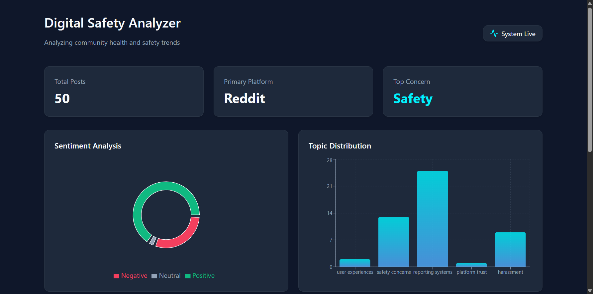

# Digital Safety in Online Communities Analyzer

A complete system to collect, analyze, and visualize discussions about online safety from communities like Reddit.

## Project Structure
- `/data_collection`: Python scraper and sample generator.
- `/data_analysis`: Python NLP processing pipeline.
- `/cpp_tools`: High-performance C++ keyword analyzer.
- `/backend`: Node.js + Express REST API.
- `/frontend`: React + Vite dashboard with Recharts.
- `/dataset_sample`: Processed JSON datasets.

## Requirements
- Python 3.8+
- Node.js & npm
- MongoDB (running locally or a connection string)
- C++ Compiler (g++)

## Dashboard Preview
The dashboard is now fully operational, displaying analysis results from the 50 sample posts.



## Setup and Running

### 1. Data Pipeline
```bash
# Setup Python environment
python -m venv venv
.\venv\Scripts\activate
pip install -r requirements.txt

# Option A: Scrape real data (requires Chrome)
python data_collection/reddit_scraper.py

# Option B: Generate sample data (Recommended for testing)
python data_collection/generate_sample.py

# Process data
python data_analysis/process_posts.py

# Run C++ Analyzer (Compile first if needed: g++ cpp_tools/keyword_analyzer.cpp -o cpp_tools/keyword_analyzer.exe)
.\cpp_tools\keyword_analyzer.exe dataset_sample/processed_posts.json > dataset_sample/keyword_summary.json
```

### 2. Backend
```bash
cd backend
npm install
# Import data to MongoDB (ensure MongoDB is running)
python import_data.py
# Start server
npm start
```

### 3. Frontend
```bash
cd frontend
npm install
npm run dev
```

## Technologies Used
- **Frontend**: React, Recharts, Lucide-React
- **Backend**: Node.js, Express, Mongoose
- **Database**: MongoDB
- **Processing**: Python (Pandas, NLTK, VADER), C++ (Keyword Frequency)
- **Scraping**: Selenium, BeautifulSoup

## Research Summary
Check [research_summary.md](./research_summary.md) for findings from the sample dataset.
